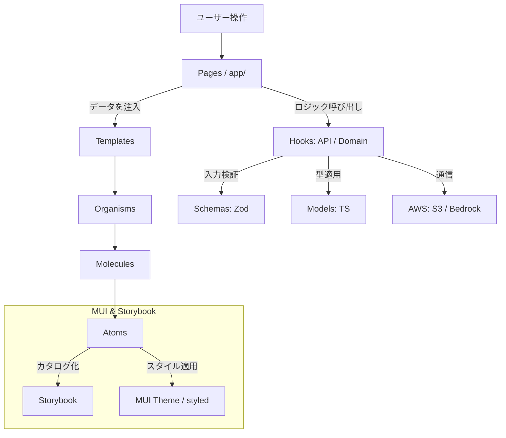

# AI分析機能付き家計簿アプリ フロントエンド詳細設計書

## 1. プロジェクト概要・設計思想

本設計書は、マネーフォワードのCSVデータを基に、エンジニア目線での分析を行う家計簿アプリのフロントエンド構造を定義します。スタイリング手法をMUI（Material UI）に集約し、1名での開発効率を最大化します。

### 基本方針

- **型安全の徹底**: Models による型定義と、Schemas (Zod) によるランタイムバリデーションの分離。
- **責務の分離**: ビジネスロジックを Hooks に閉じ込め、UI（Components）を純粋な表示器として保つ。
- **階層化 UI**: アトミックデザインに Templates 層を加え、MUI の `styled` ユーティリティでスタイリングを完結させる。
- **カタログ駆動開発**: 全てのコンポーネントを Storybook で管理し、独立した開発とテストを可能にする。

---

## 2. データ定義・通信層 (src/models & src/schemas)

### 2.1 Models (TypeScript 型定義)

| モデル名 | 概要 | 備考 |
| :--- | :--- | :--- |
| `Amount` | 通貨コードと数値を含む金額オブジェクト。 | `unit: string; value: number;` |
| `TransactionModel` | 1件の取引明細。 | `id`, `date`, `amount`, `content`, `category`等 |
| `MonthlySummaryModel` | カテゴリ別合計、前月比などの集計結果。 | グラフ表示・AI分析のインプット |
| `AIReportModel` | AIが生成した分析レポート。 | Markdown形式を含む |

### 2.2 Schemas (Zod による検証)

| スキーマ名 | 役割 |
| :--- | :--- |
| `transactionResponseSchema` | APIからのレスポンスが TransactionModel を満たすか検証。 |
| `mfCsvFileSchema` | マネーフォワードCSVのヘッダー・データ型・ファイル形式を検証。 |

---

## 3. カスタムHooks一覧 (src/hooks)

| Hooks名 | 分類 | 役割概要 |
| :--- | :--- | :--- |
| `useTransactions` | API | TanStack Query を利用し、データのフェッチ・キャッシュを管理。 |
| `useMFUploader` | API | `mfCsvFileSchema` で検証後、S3 へのアップロードフローを実行。 |
| `useTransactionSummary` | Domain | 明細一覧から月次の集計やカテゴリ別計算を行うロジック。 |
| `useAIAnalyzer` | API | 集計データを基に Bedrock へ解析リクエストを送り、結果を管理。 |

---

## 4. コンポーネント一覧 (src/components)

UIパーツのスタイリングは、MUIの `styled` ユーティリティと `sx` プロップスに集約します。

### 4.1 Atoms / Molecules (最小・複合部品)

| 名前 | 階層 | 実装方針 |
| :--- | :--- | :--- |
| `MoneyButton` | Atom | `styled(Button)` を使用。ローディング表示機能付き。 |
| `MarkdownRenderer` | Atom | `Box` の `sx` プロップスで AI 出力のスタイルを制御。 |
| `SkeletonRow` | Molecule | `Skeleton` を組み合わせ、ロード中の「枠」を表示。 |
| `CategoryBadge` | Molecule | `Chip` をベースにカテゴリ別配色と **Material Icons** を表示。 |

### 4.2 Organisms / Templates

| 名前 | 概要・役割 |
| :--- | :--- |
| `LegalResultTable` | 明細一覧を表示。ソートやフィルタリングを制御。 |
| `AIReportCard` | `useAIAnalyzer` の状態に応じ、AI レポートを表示。 |
| `DashboardTemplate` | サイドナビ、集計カード、テーブルの配置を定義する枠組み。 |
| `AnalysisTemplate` | チャートと AI レポートを並べる分析画面専用のレイアウト。 |

---

## 5. ディレクトリ構成

```text
src/
├── app/             # Next.js Pages (Router)
├── models/          # TypeScript 型定義
├── schemas/         # Zod バリデーション
├── hooks/           # ビジネスロジック (API/Domain)
├── components/      # UI コンポーネント
│   ├── atoms/
│   ├── molecules/
│   ├── organisms/
│   └── templates/   # レイアウト構造定義
├── lib/             # MUI Theme / Axios / QueryClient 設定
├── stories/         # Storybook 用ファイル
└── constants/       # カテゴリ名、APIエンドポイント等の固定値
```

### 6 依存関係図


