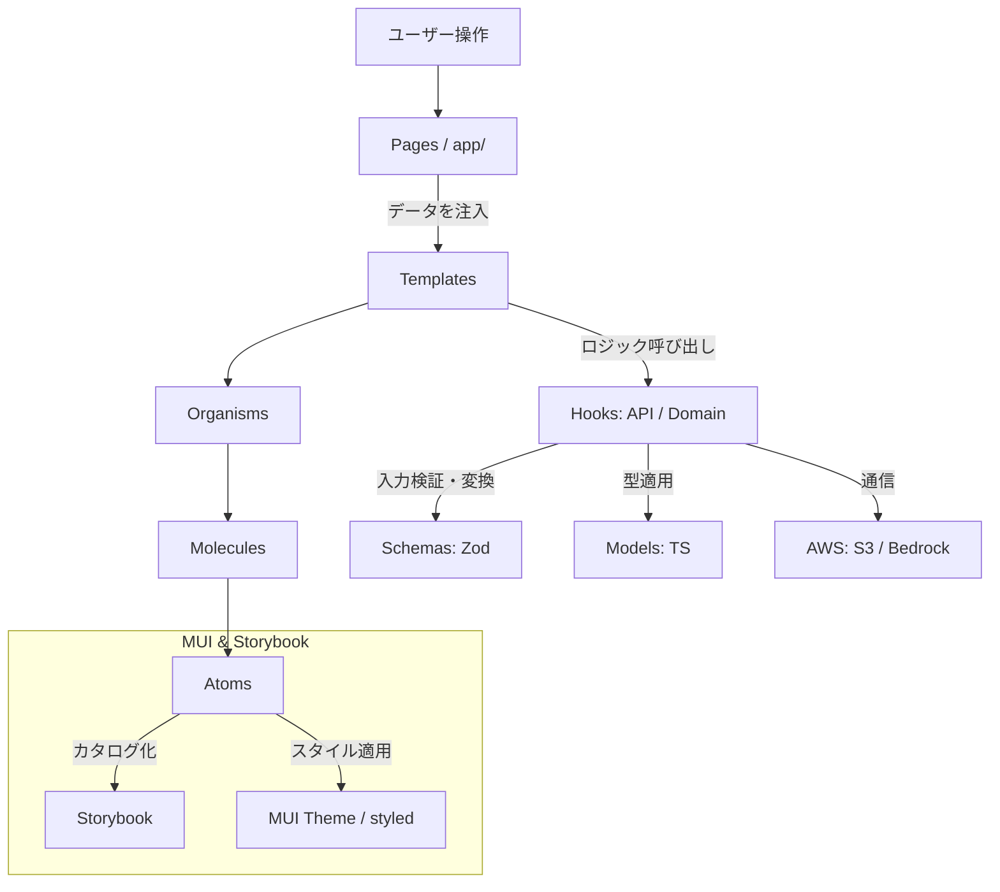

# AI分析機能付き家計簿アプリ フロントエンド詳細設計書

## 1. プロジェクト概要・設計思想

マネーフォワードのCSVデータを基に、エンジニア目線での高度な分析を行う家計簿アプリのフロントエンド構造を定義します。

### 基本方針

* **型安全の徹底**: Models による型定義と、Schemas (Zod) によるランタイムバリデーションの分離。
* **Data Mapping の一元化**: 外部の日本語ヘッダーを `transform` ロジックにより内部用英語プロパティへ即座に変換し、ロジック層への汚染を防ぐ。
* **スタイリングの完全分離**: MUI の `sx` プロップス使用を原則禁止し、`styled` ユーティリティに集約することで JSX の可読性を最大化する。
* **カタログ駆動開発**: 全てのコンポーネントを Storybook で管理し、独立した開発と視覚的テストを可能にする。

---

## 2. データ定義・通信層 (src/models & src/schemas)

### 2.1 Models (TypeScript 型定義)

| モデル名 | 概要 | 備考 |
| :--- | :--- | :--- |
| `Amount` | 通貨コードと数値を含む金額オブジェクト。 | `unit: string; value: number;` |
| `TransactionModel` | 1件の取引明細。 | `id`, `date`, `amount: Amount`, `content`, `category`, `subCategory`, `isCalculated?`, `isTransfer?`, `isFixedCost`, `memo`, `source` 等 |
| `MonthlySummaryModel` | 月次の集計結果。 | `month`, `incomeTotal`, `expenseTotal`, `balance`, `categories[{ name, amount, percentage, kind }]` |
| `AIReportModel` | AIが生成した分析レポート。 | Markdown形式を含む |

### 2.2 Schemas (Zod による検証 & 変換)

| スキーマ名 | 役割 | 備考 |
| :--- | :--- | :--- |
| `transactionResponseSchema` | APIからのレスポンス検証。 | |
| `mfCsvFileSchema` | マネーフォワードCSVの検証。 | **重要**: 日本語ヘッダーを英語プロパティへ変換する `transform` を含み、`isCalculated`/`isTransfer` 等のフラグも付与する。 |

---

## 3. カスタムHooks一覧 (src/hooks)

| Hooks名 | 分類 | 役割概要 |
| :--- | :--- | :--- |
| `useTransactions` | API | TanStack Query を利用し、データのフェッチ・キャッシュを管理。 *(将来導入予定)* |
| `useMFUploader` | API | FileReader + PapaParse + `mfCsvFileSchema` でCSVを解析し、一意な `id` を付与した `Transaction` 配列とエラー状態を管理。 |
| `useTransactionSummary` | Domain | `TransactionModel[]` から月次の集計 (`MonthlySummaryModel[]`) を算出。`isCalculated === false` / `isTransfer === true` を除外し、`amount.value` の正負で収入/支出を判定。 |
| `useTransactionAutoAnalyzer` | API | `TransactionModel[]` を `/api/analyze` に送信し、AIが推論した `category` / `subCategory` / `isFixedCost` / `memo` をマージする自動仕訳用 Hooks。 |
| `useAIAnalyzer` | API | 集計データから AI レポート (`AIReportModel`) を生成する Hooks |

---

## 4. コンポーネント一覧 (src/components)

### 4.1 Atoms / Molecules (最小・複合部品)

| 名前 | 階層 | 実装方針 |
| :--- | :--- | :--- |
| `MoneyText` | Atom | `Amount` を「1,234 円」形式で表示する。`styled('span')` を使用。 |
| `MarkdownRenderer` | Atom | `styled(Box)` で AI 出力の Markdown スタイルを制御。*(Phase4で利用予定)* |
| `SummaryCardHeader` | Molecule | 月次サマリーカードのヘッダー（ラベル・タイトル・月選択）を表示。 |
| `SummaryMetricTiles` | Molecule | 合計収入/支出/残高を3つのタイルとして表示。 |
| `SummaryCategoryBreakdown` | Molecule | 月次カテゴリ別内訳（最大数件）と割合バーを表示。 |
| `TransactionTableSectionHeader` | Molecule | 取引テーブルセクションのタイトル＋補足テキストを表示。 |
| `TransactionDataGridPanel` | Molecule | 取引用 `DataGrid` をカード内に配置し、見た目を統一。 |
| `TransactionAutoAnalyzeToolbar` | Molecule | AI自動仕訳ボタン付きの DataGrid ツールバー。 |

### 4.2 Organisms / Templates

| 名前 | 階層 | 概要・役割 |
| :--- | :--- | :--- |
| `S3UploadMonitor` | Organism | 純粋な「ファイル受信」と「解析進捗」の表示に特化。`useMFUploader` を利用。 |
| `TransactionGrid` | Organism | タイトル行＋ `TransactionModel` 用 `DataGrid`（任意のツールバー付き）をまとめた共通レイアウト。 |
| `TransactionTable` | Organism | `TransactionGrid` を用いた通常の取引一覧テーブル（AIボタンなし）。 |
| `TransactionPreviewTable` | Organism | `TransactionGrid` ＋ `TransactionAutoAnalyzeToolbar` により、AI自動仕訳付きプレビューテーブルを提供。 |
| `SummaryCard` | Organism | `SummaryCardHeader` / `SummaryMetricTiles` / `SummaryCategoryBreakdown` を組み合わせた月次サマリー表示。 |
| `AIReportCard` | Organism | `useAIAnalyzer` の結果を Markdown で表示するレポートカード。（Phase4 で実装予定） |
| **`TransactionImportTemplate`** | Template | `S3UploadMonitor` → `SummaryCard` → `TransactionTable` の流れで、CSVアップロードから集計/テーブル表示までのフローを管理。 |
| `DashboardTemplate` | Template | サイドナビ、集計カード、テーブル、AIレポートの配置を定義するメインレイアウト。（将来拡張用） |

---

## 5. ディレクトリ構成

```text
src/
├── models/          # TypeScript 型定義 (出力型)
├── schemas/         # Zod バリデーション & Transform (変換ロジック)
├── hooks/           # ビジネスロジック
├── components/      # UI コンポーネント
│   ├── atoms/       # MUI 基本コンポーネントのラップ
│   ├── molecules/   # 複数の Atom の組み合わせ
│   ├── organisms/   # 独立した機能ブロック
│   └── templates/   # 画面レイアウト・フロー制御
├── lib/             # MUI Theme / Axios / QueryClient 設定
├── stories/         # Storybook 用ファイル
└── constants/       # カテゴリ名、APIエンドポイント等の固定値
```

### 6 依存関係図


