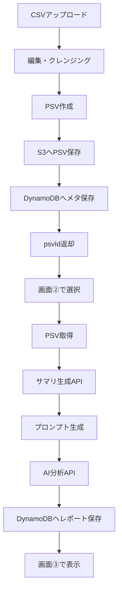

# AI分析機能付き家計簿アプリ フロントエンド詳細設計書（3画面構成・修正版）

---

## 1. 設計変更の背景

### Before

- CSVアップロード → AI分析 → レポート表示（1画面で一気通貫）

### After

責務分離により3画面構成へ変更する。

1. CSVアップロード & 編集（データクレンジング）画面
2. PSVベース AI分析実行画面
3. AIレポート表示画面

---

## 2. 全体アーキテクチャ方針

### 2.1 データの役割分担

- **S3**: PSV本体の保存先。編集完了ごとに新しいPSVを保存する。
- **DynamoDB**: PSVのメタ情報、検索用インデックス、サマリ、レポートの保存先。
- **Reactフロントエンド**: 編集中データと選択中PSVのIDを保持する。
- **AI分析**: サマリデータと必要に応じたPSV抜粋を元に実行する。

### 2.2 設計原則

- 保存済みデータの正本はS3とする。
- フロントはPSV本文を永続保持しない。
- 「最新PSV」は `psvId` で特定し、フロントには `selectedPsvId` として保持する。
- 画面②と画面③は、保存済みの `psvId` / `reportId` から再取得できることを前提とする。

---

## 3. データフロー



---

## 4. 画面①：CSVアップロード & 編集画面

### 4.1 役割

- CSVのアップロード
- データの正規化
- 不要データの削除
- 編集結果から新しいPSVを作成
- 作成したPSVをS3へ保存
- DynamoDBへメタ情報を登録

### 4.2 画面要件

- 編集中のデータをテーブル形式で表示する
- 行削除・修正・補正ができる
- 保存前に検証エラーを表示する
- 保存完了後に `psvId` を受け取る
- 画面遷移時は `psvId` を次画面へ引き渡す

### 4.3 コンポーネント構成

| コンポーネント | 役割 |
|---|---|
| CSVUploadArea | CSVファイルの選択・読込 |
| TransactionEditableGrid | 編集可能な明細一覧 |
| DataCleaningToolbar | 行削除、補正、再解析などの操作 |
| ValidationAlert | 入力エラーの表示 |
| SavePSVButton | 編集済みデータの保存 |
| SaveCompleteDialog | 保存完了と次画面誘導 |

### 4.4 Hooks

| Hooks | 役割 |
|---|---|
| useMFUploader | CSV解析と初期データ化 |
| useEditableTransactions | 編集状態管理 |
| useValidation | データ検証 |
| usePSVExporter | PSV生成 |
| useSavePSV | S3保存 + DynamoDB登録 |

### 4.5 状態管理

```ts
type TransactionDraft = {
  id: string;
  date: string;
  amount: number;
  content: string;
  category: string;
  subCategory: string;
  isInvalid?: boolean;
};

type UploadEditState = {
  draftTransactions: TransactionDraft[];
  selectedRowIds: string[];
  validationErrors: string[];
  isDirty: boolean;
};
```

### 4.6 PSV変換ロジック

```ts
const toPSV = (transactions: TransactionDraft[]): string => {
  return transactions
    .filter((t) => !t.isInvalid)
    .map((t) =>
      [
        t.date,
        t.amount,
        t.content,
        t.category,
        t.subCategory,
      ].join("|")
    )
    .join("\n");
};
```

### 4.7 保存API

#### `POST /api/psv`

編集済みデータを保存する。

#### リクエスト例

```json
{
  "userId": "user-001",
  "fileName": "mf_2026_03.csv",
  "transactions": [
    {
      "date": "2026-03-01",
      "amount": -1200,
      "content": "昼食",
      "category": "食費",
      "subCategory": "外食"
    }
  ]
}
```

#### レスポンス例

```json
{
  "psvId": "psv_20260301_001",
  "version": 12,
  "isLatest": true,
  "s3Path": "users/user-001/psv/psv_20260301_001.psv"
}
```

### 4.8 保存時の責務

- S3にPSV本体を保存する
- DynamoDBにメタ情報を保存する
- 最新PSVの参照更新を行う
- フロントには `psvId` のみ返す

---

## 5. 画面②：AI分析実行画面

### 5.1 役割

- 対象PSVの選択
- S3からPSV本体を取得
- サマリ生成
- プロンプト生成
- AI分析実行
- 分析結果を保存

### 5.2 画面要件

- デフォルトでは最新PSVを表示する
- 一度選択したPSVは `selectedPsvId` として保持する
- 再表示時は `psvId` ベースで復元する
- サマリ生成前にデータ確認ができる
- AI実行前にプロンプト内容を確認・編集できる

### 5.3 コンポーネント構成

| コンポーネント | 役割 |
|---|---|
| PSVSelector | 分析対象PSVの選択 |
| PSVSummaryPanel | PSVの要約表示 |
| SummaryPreviewCard | サマリのプレビュー表示 |
| PromptEditor | プロンプト編集 |
| RunAnalysisButton | AI分析実行 |
| LoadingOverlay | 処理中表示 |
| AnalysisStatusBadge | 実行状態表示 |

### 5.4 Hooks

| Hooks | 役割 |
|---|---|
| usePSVLoader | PSV取得 |
| useSelectedPSV | 選択中PSVの管理 |
| useSummaryGenerator | サマリ生成API呼び出し |
| usePromptBuilder | プロンプト生成 |
| useAIAnalyzer | AI分析実行 |
| useAnalysisHistory | 過去分析履歴の取得 |

### 5.5 フロント状態

```ts
type AnalysisState = {
  selectedPsvId: string | null;
  summary: Summary | null;
  prompt: string;
  aiReport: AIReportModel | null;
  isAnalyzing: boolean;
};
```

### 5.6 サマリデータ仕様

サマリ生成APIでは、以下の5観点でデータを生成する。

#### ① 月間KPI（1行サマリー）

##### 例

```json
{
  "month": "2026-03",
  "totalIncome": 300000,
  "totalExpense": 120000,
  "balance": 180000,
  "savingRate": 60
}
```

#### ② カテゴリ別内訳

##### 例

```json
{
  "categories": [
    { "name": "食費", "amount": 40000, "percentage": 33.3 },
    { "name": "固定費", "amount": 50000, "percentage": 41.6 }
  ]
}
```

#### ③ 日次推移

##### 例

```json
{
  "dailyTrend": [
    { "date": "2026-03-01", "expense": 3000 },
    { "date": "2026-03-02", "expense": 5000 }
  ]
}
```

#### ④ 上位支出ランキング

##### 例：topExpenses

```json
{
  "topExpenses": [
    { "content": "家賃", "amount": 70000 },
    { "content": "外食", "amount": 15000 }
  ]
}
```

#### ⑤ 固定費

##### 例：fixedCosts

```json
{
  "fixedCosts": [
    { "content": "家賃", "amount": 70000 },
    { "content": "サブスク", "amount": 5000 }
  ]
}
```

### 5.7 プロンプト生成仕様

プロンプトには、サマリデータに加えて **必要最小限に整形した生データ（PSV抜粋）** を渡す。

```ts
const buildPrompt = (summary: Summary, psv: string) => `
あなたは優秀な家計分析アドバイザーです。

以下の「サマリデータ」と「生データ（PSV）」を元に分析してください。
サマリだけで判断せず、必ず生データも参照して具体的に分析してください。

====================================
■ 月間KPI
収入: ${summary.kpi.totalIncome}
支出: ${summary.kpi.totalExpense}
貯蓄率: ${summary.kpi.savingRate}%

■ カテゴリ別内訳
${summary.categories
  .map((c) => `${c.name}: ${c.amount}円 (${c.percentage}%)`)
  .join("\n")}

■ 日次推移
${summary.dailyTrend.map((d) => `${d.date}: ${d.expense}円`).join("\n")}

■ 上位支出
${summary.topExpenses.map((e) => `${e.content}: ${e.amount}円`).join("\n")}

■ 固定費
${summary.fixedCosts.map((f) => `${f.content}: ${f.amount}円`).join("\n")}
====================================

■ 生データ（PSV形式）
※形式: date|amount|content|category|subCategory

${psv}

====================================

【出力要件】
1. 支出の特徴（3点）
2. 無駄遣いの可能性（具体的な取引ベースで指摘）
3. 改善アクション（実行可能なものを3つ）
4. 固定費の見直し提案
5. エンジニア向けの合理的な節約戦略

具体的な取引（content）を引用して説明してください。
`;
```

### 5.8 生データ投入時の制御

PSVをそのまま全量渡すとトークン超過や品質劣化が起きるため、投入前に制御する。

```ts
const limitedPSV = psv.split("\n").slice(0, 200).join("\n");
```

必要に応じて、以下のような抽出も行う。

```ts
const importantRows = transactions
  .filter((t) => t.amount < -5000)
  .slice(0, 100);
```

### 5.9 サマリ生成API

#### `POST /api/summary/{psvId}`

S3のPSVをもとにサマリを生成し、DynamoDBへ保存する。

### 5.10 AI分析API

#### `POST /api/analyze/{psvId}`

サマリとPSV抜粋をもとにAI分析を実行し、レポートをDynamoDBへ保存する。

---

## 6. 画面③：AIレポート表示画面

### 6.1 役割

- AI結果の表示
- グラフ表示
- Markdownレポート表示
- 過去レポートの再表示

### 6.2 コンポーネント構成

| コンポーネント | 役割 |
|---|---|
| AIReportCard | Markdown形式のレポート表示 |
| SummaryChart | グラフ表示 |
| InsightHighlight | 重要ポイントの強調表示 |
| ReportHistoryList | 過去レポート一覧 |
| ReportDetailPanel | レポート詳細表示 |

### 6.3 Hooks

| Hooks | 役割 |
|---|---|
| useAIReport | レポート取得 |
| useReportHistory | 履歴一覧取得 |

### 6.4 表示データ

```ts
type AIReportModel = {
  reportId: string;
  psvId: string;
  promptSnapshot: string;
  summarySnapshot: Summary;
  reportMarkdown: string;
  createdAt: string;
};
```

### 6.5 表示時の注意点

- Markdownレンダリング時はXSS対策を行う
- レポートは `reportId` 単位で再表示可能にする
- AI結果は再生成可能だが、必ず元の `psvId` と紐付ける

---

## 7. データモデル

### 7.1 PSVメタデータ

```ts
type PsvMeta = {
  psvId: string;
  userId: string;
  fileName: string;
  version: number;
  isLatest: boolean;
  createdAt: string;
  updatedAt: string;
  s3Path: string;
};
```

### 7.2 サマリ

```ts
type Summary = {
  kpi: {
    month: string;
    totalIncome: number;
    totalExpense: number;
    balance: number;
    savingRate: number;
  };
  categories: Array<{
    name: string;
    amount: number;
    percentage: number;
  }>;
  dailyTrend: Array<{
    date: string;
    expense: number;
  }>;
  topExpenses: Array<{
    content: string;
    amount: number;
  }>;
  fixedCosts: Array<{
    content: string;
    amount: number;
  }>;
};
```

### 7.3 レポート

```ts
type AIReportModel = {
  reportId: string;
  psvId: string;
  summarySnapshot: Summary;
  promptSnapshot: string;
  reportMarkdown: string;
  createdAt: string;
};
```

---

## 8. 状態管理

### 8.1 方針

- 編集中のデータはローカル状態で管理する
- 保存済みデータは `psvId` をキーに取得する
- サマリとレポートはサーバーキャッシュ対象とする

### 8.2 推奨構成

- ローカル状態: `useState` / `useReducer`
- サーバー状態: TanStack Query
- グローバル選択状態: Zustand

### 8.3 状態分離

```ts
type AppState = {
  draftTransactions: TransactionDraft[];
  selectedPsvId: string | null;
  summary: Summary | null;
  aiReport: AIReportModel | null;
};
```

---

## 9. API一覧

| API | Method | 内容 |
|---|---|---|
| `/api/psv` | POST | PSV作成・S3保存・Dynamo登録 |
| `/api/psv/{psvId}` | GET | PSV取得 |
| `/api/psv/latest` | GET | 最新PSV取得 |
| `/api/summary/{psvId}` | POST | サマリ生成 |
| `/api/summary/{psvId}` | GET | サマリ取得 |
| `/api/analyze/{psvId}` | POST | AI分析実行 |
| `/api/report/{reportId}` | GET | レポート取得 |
| `/api/reports` | GET | レポート履歴一覧 |

---

## 10. DynamoDB設計

### 10.1 保存対象

- PSVメタ情報
- サマリ
- レポート履歴
- 最新PSV参照

### 10.2 キー設計

- Partition Key: `userId`
- Sort Key: `entityType#entityId`

### 10.3 保存例

```json
{
  "userId": "user-001",
  "sk": "PSV#psv_20260301_001",
  "entityType": "PSV",
  "psvId": "psv_20260301_001",
  "s3Path": "users/user-001/psv/psv_20260301_001.psv",
  "isLatest": true,
  "version": 12
}
```

---

## 11. S3設計

### 11.1 保存方針

- PSV本体はS3に保存する
- バックアップとしての役割ではなく、**本体ストレージ**として扱う
- バージョニングを有効にする

### 11.2 パス設計

```text
users/{userId}/psv/{psvId}.psv
users/{userId}/reports/{reportId}.md
users/{userId}/snapshots/{psvId}/summary.json
```

---

## 12. エラーハンドリング

### 12.1 画面①

- CSV形式不正
- 必須列不足
- 数値変換失敗
- 保存失敗

### 12.2 画面②

- PSV取得失敗
- サマリ生成失敗
- AI分析失敗
- トークン超過

### 12.3 画面③

- レポート取得失敗
- Markdown描画失敗
- 解析不能なAI出力

### 12.4 リトライ方針

- 通信失敗は再試行ボタンを表示
- 保存失敗は再保存可能にする
- AI失敗は前回レポートを残す

---

## 13. セキュリティ

- CSVやAI出力をそのままHTMLとして描画しない
- Markdownはサニタイズを通す
- S3は直接公開しない
- API認証を前提とする
- 取得対象は必ず `userId` と `psvId` で検証する
- 環境変数に秘密情報を置く場合はクライアントへ露出させない

---

## 14. パフォーマンス

- 大量取引時は仮想スクロールを使う
- 編集テーブルは行単位で差分更新する
- サマリとレポートはキャッシュする
- プロンプトには全量PSVを入れず、必要行だけ渡す
- 不要な再レンダリングを避けるため、テーブル行はメモ化する

---

## 15. 保守性・拡張性

### 15.1 将来拡張しやすい点

- PSV保存とAI分析が分離されている
- 履歴管理が `psvId` / `reportId` ベースで可能
- サマリ生成ロジックを差し替えやすい

### 15.2 技術的負債になりやすい点

- フロントにPSV本文を持ち回る設計
- 「最新」の解釈が曖昧なままの実装
- AIプロンプトが肥大化する実装
- DynamoDBに本体データを入れようとする設計

---

## 16. ディレクトリ構成

```text
src/
├── features/
│   ├── upload-edit/
│   ├── analysis/
│   └── report/
├── hooks/
├── models/
├── schemas/
├── components/
├── services/
├── stores/
└── utils/
```

---

## 17. 設計上のメリット

- データの正本が明確になる
- 再分析がしやすい
- 画面間の責務が分かれる
- 変更に強い構造になる
- AIの入力品質を制御しやすい

---

## 18. 変更点まとめ

- S3はバックアップではなくPSV本体の保存先とする
- DynamoDBはメタ情報、サマリ、レポートの保存先とする
- フロントはPSV本文ではなく `psvId` を保持する
- AIプロンプトにはサマリと必要最小限のPSV抜粋を渡す
- 最新データの取り扱いは `isLatest` と `selectedPsvId` で制御する
- レポートは `reportId` と `psvId` で再取得可能にする
