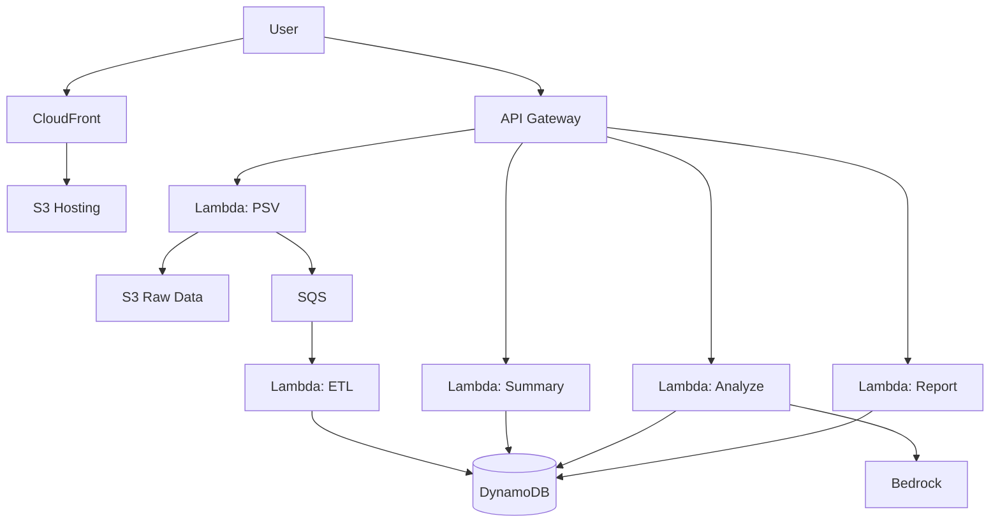
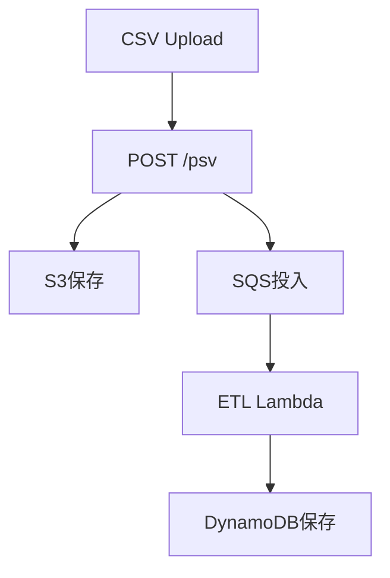
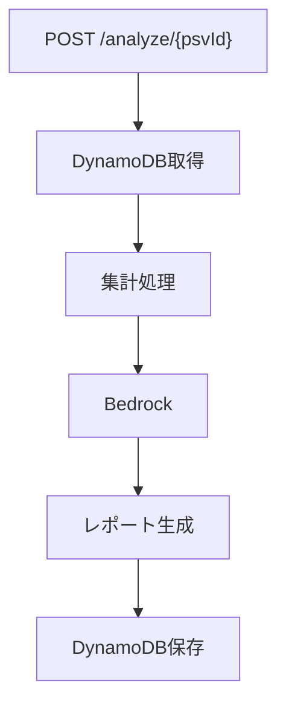
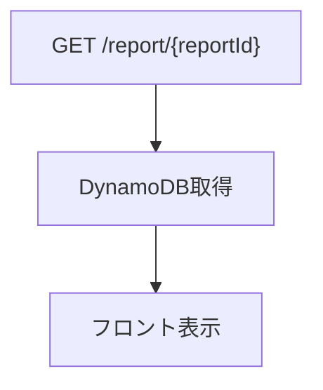

# AI分析機能付き家計簿アプリ

## フロント＋バックエンド統合 詳細設計書（AWS版・完全版）

---

## 1. 設計方針（最重要）

## 1.1 アーキテクチャ思想

### Before（現行）

- mockStore中心
- Next.js API内で完結
- 同期処理

### After（AWS版）

- API Gateway + Lambda + 非同期処理
- psvId中心のデータ管理
- スケーラブルなイベント駆動設計

---

## 1.2 設計原則

- 主キー：`psvId` / `reportId`
- CSV処理：非同期
- AI分析：同期（初期）
- データ：S3 + DynamoDB分離
- API：責務ごとにLambda分割

---

## 2. 全体アーキテクチャ



## 3. データフロー

## 3.1 CSVアップロード（Step1）



---

## 3.2 AI分析（Step2）



---

## 3.3 レポート表示（Step3）



---

## 4. API設計

## 4.1 PSV API

### POST /psv

#### 役割

- CSVアップロード受付
- 非同期処理開始

#### リクエスト

```json
{
  "fileName": "mf.csv"
}
```

#### レスポンス

```json
{
  "psvId": "psv_xxxx",
  "status": "processing"
}
```

---

### GET /psv/{psvId}

```json
{
  "psvId": "psv_xxxx",
  "status": "ready",
  "summary": {}
}
```

---

## 4.2 Summary API

### POST /summary/{psvId}

- DynamoDBから集計
- summary生成

---

## 4.3 Analyze API

### POST /analyze/{psvId}

```json
{
  "promptOverride": "任意"
}
```

#### 処理

- summary取得
- Bedrock実行
- report保存

---

## 4.4 Report API

### GET /report/{reportId}

---

## 5. データモデル

## 5.1 PSV

```ts
type PsvModel = {
  psvId: string;
  userId: string;
  status: "processing" | "ready" | "error";
  fileName: string;
  createdAt: string;
};
```

---

## 5.2 Transaction

```ts
type TransactionModel = {
  psvId: string;
  date: string;
  amount: number;
  category: string;
  subCategory: string;
};
```

---

## 5.3 Summary

```ts
type SummaryModel = {
  psvId: string;
  incomeTotal: number;
  expenseTotal: number;
  categories: any[];
};
```

---

## 5.4 Report

```ts
type AIReportModel = {
  reportId: string;
  psvId: string;
  reportMarkdown: string;
  createdAt: string;
};
```

---

## 6. DynamoDB設計

## テーブル①：PSV

| PK    | 内容     |
| ----- | -------- |
| psvId | メタ情報 |

---

## テーブル②：Transactions

| PK    | SK      |
| ----- | ------- |
| psvId | date#id |

---

## テーブル③：Reports

| PK       | 内容       |
| -------- | ---------- |
| reportId | レポート   |

---

## 7. S3設計

## バケット構成

| バケット | 用途     |
| -------- | -------- |
| frontend | 静的配信 |
| raw-data | CSV保存  |

---

## パス構造

```text
/raw/{userId}/{psvId}.csv
```

---

## 8. 非同期処理設計

## SQS

- CSVアップロード後に投入
- 冪等性考慮

---

## ETL Lambda

処理内容：

1. CSV読み込み
2. PSV変換
3. バリデーション
4. DynamoDB保存
5. status更新

---

## 9. フロント設計変更

## Step1

```diff
- 保存後すぐ遷移
+ 「処理中」表示
```

---

## Step2

```diff
+ psv.statusチェック
```

---

## 状態管理

```ts
type SelectedPsvState = {
  psvId: string;
  status: string;
};
```

---

## 10. エラーハンドリング

## CSV処理失敗

- status = error

## AI失敗

- retry可能

## DynamoDB失敗

- DLQ（SQS）へ

---

## 11. セキュリティ

- API Gateway認証（将来）
- S3署名付きURL
- IAM最小権限

---

## 12. パフォーマンス

- Lambda並列処理
- DynamoDBオンデマンド
- CloudFrontキャッシュ

---

## 13. コスト最適化

- S3（低コスト）
- Lambda従量課金
- DynamoDBオンデマンド
- Bedrock従量

---

## 14. メリット

- スケーラブル
- コスト最小
- 責務分離明確
- 将来拡張容易

---

## 15. 今後の拡張

- 認証（Cognito）
- レポート履歴UI
- 分析ジョブ非同期化
- Step Functions導入

---

## ✅ 最終まとめ

- mock → AWSへ自然移行
- フロント設計を活かせる
- サーバーレス構成で最適化
