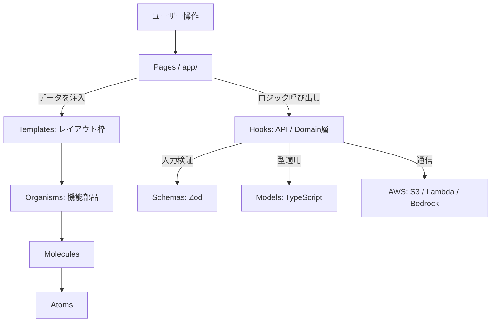

# AI分析機能付き家計簿アプリ フロントエンド詳細設計書

## 1. プロジェクト概要・設計思想

本設計書は、マネーフォワードのCSVデータを基に、エンジニア目線での分析を行う家計簿アプリのフロントエンド構造を定義します。

### 基本方針

- **型安全の徹底**: Models による型定義と、Schemas (Zod) によるランタイムバリデーションの分離。
- **責務の分離**: ビジネスロジックを Hooks に閉じ込め、UI（Components）を純粋な表示器として保つ。
- **階層化 UI**: アトミックデザインに Templates 層を加え、レイアウトの再利用性を向上させる。

---

## 2. データ定義・通信層 (src/models & src/schemas)

### 2.1 Models (TypeScript 型定義)

API や外部データとやり取りする際の「データの形状」を定義します。

| モデル名 | 概要 | 備考 |
| :--- | :--- | :--- |
| `Amount` | 通貨コードと数値を含む金額オブジェクト。 | `unit: string; value: number;` |
| `TransactionModel` | 1件の取引明細（日付、金額、内容、カテゴリ）。 | |
| `MonthlySummaryModel` | 月次のカテゴリ別合計や前月比の集計構造。 | |
| `AIReportModel` | Bedrockから返却される分析レポート構造。 | Markdown形式を含む |
| `AuthModel` | ユーザー認証情報。 | Cognito等との連携用 |

### 2.2 Schemas (Zod による検証)

外部からの入力データが Models の型を満たしているか、実行時に検証します。

| スキーマ名 | 役割 |
| :--- | :--- |
| `transactionResponseSchema` | APIレスポンスが TransactionModel を満たすか検証。 |
| `mfCsvFileSchema` | アップロードされたCSVのヘッダーおよびデータ型を検証。 |
| `aiSettingsSchema` | 分析トーンなどの設定入力値のバリデーション。 |

---

## 3. カスタムHooks一覧 (src/hooks)

Hooksを「API（通信）」と「Domain（ロジック）」に分類し、再利用性を高めます。

### 3.1 API Hooks (外部通信)

| Hooks名 | 役割概要 |
| :--- | :--- |
| `useTransactions` | TanStack Query を用い、DynamoDB から明細を取得・キャッシュ。 |
| `useMFUploader` | `mfCsvFileSchema` で検証後、S3 へのアップロードフローを実行。 |
| `useAIAnalyzer` | 集計データを Bedrock へ送り、`AIReportModel` を取得。 |

### 3.2 Domain Hooks (計算・加工)

| Hooks名 | 役割概要 |
| :--- | :--- |
| `useTransactionSummary` | 明細一覧から月次のカテゴリ別集計や固定費判定を行う。 |
| `useCurrencyFormatter` | `Amount` オブジェクトを表示用に整形するロジックを共通化。 |

---

## 4. コンポーネント一覧 (src/components)

アトミックデザインを採用し、UI の責任範囲を5段階に分離します。

| 階層 | 名前 | 概要・役割 |
| :--- | :--- | :--- |
| **Atoms** | `MoneyButton` | アプリ共通のボタンスタイル。ローディング表示機能付き。 |
| **Atoms** | `MarkdownRenderer` | AIからの出力を安全かつ一貫したスタイルで描画。 |
| **Molecules** | `SkeletonRow` | ロード中のプレースホルダー表示。 |
| **Molecules** | `CategoryBadge` | カテゴリに応じた配色アイコンを表示するバッジ。 |
| **Organisms** | `TransactionTable` | 明細一覧を表示。ソートやフィルタリングを制御。 |
| **Organisms** | `AIReportCard` | AI分析結果を表示。`useAIAnalyzer` の状態を管理。 |
| **Templates** | `DashboardTemplate` | サイドナビ、集計カード、テーブルの配置を定義する枠組み。 |
| **Templates** | `AnalysisTemplate` | チャートとAIレポートを並べる分析画面専用のレイアウト。 |

---

## 5. ディレクトリ構成とデータフロー

### 5.1 ディレクトリ構成 (Next.js App Router)

```text
src/
├── app/             # ページ(Pages)とルーティング
├── models/          # 型定義 (TypeScript)
├── schemas/         # バリデーション (Zod)
├── hooks/           # ビジネスロジック
│   ├── api/         # 通信系 (TanStack Query等)
│   └── domain/      # 純粋な計算系
├── components/      # UIコンポーネント
│   ├── atoms/
│   ├── molecules/
│   ├── organisms/
│   └── templates/   # レイアウト構造定義
├── lib/             # ライブラリ設定 (Axios, AWS SDK)
└── constants/       # カテゴリ名、APIエンドポイント等の固定値
```

### 5.2 依存関係図


