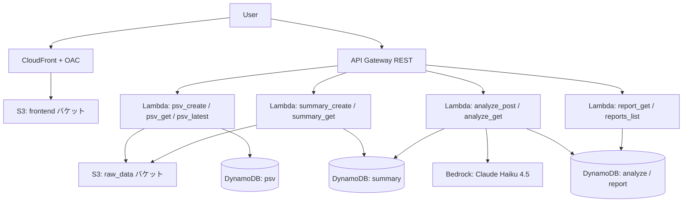
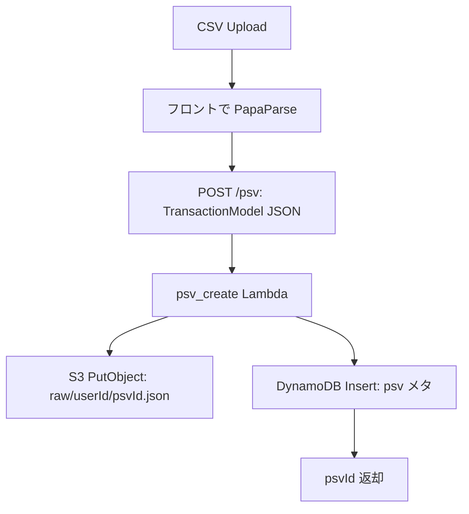
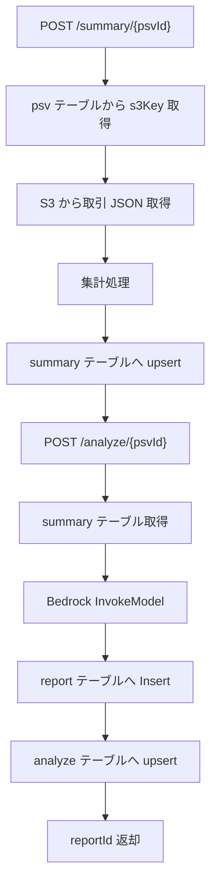
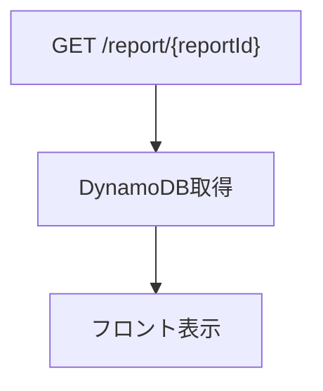

# AI分析機能付き家計簿アプリ

## フロント＋バックエンド統合 詳細設計書（AWS版・完全版）

---

## 1. 設計方針（最重要）

## 1.1 アーキテクチャ思想

### Before（現行）

- mockStore 中心
- Next.js API 内で完結
- 同期処理

### After（AWS 版）

- API Gateway + Lambda（同期）
- psvId 中心のデータ管理
- データの所在を S3 と DynamoDB で分離（取引本体は S3 / メタは DDB）
- 静的フロントは S3 + CloudFront（OAC）配信
- 非同期化（SQS + ETL）は将来拡張として保留

---

## 1.2 設計原則

- 主キー：`psvId` / `reportId`
- CSV 処理：**同期**（フロントで PapaParse 済みの JSON を送信）
- AI 分析：同期（Bedrock Claude Haiku 4.5）
- データ：S3（取引本体 JSON）+ DynamoDB（メタ・サマリー・レポート）
- API：責務ごとに Lambda 分割（9 関数）

---

## 2. 全体アーキテクチャ


```mermaid
graph TD
    U[User] --> CF[CloudFront + OAC]
    CF --> S3F[S3: frontend バケット]

    U --> APIGW[API Gateway REST]

    APIGW --> L1[Lambda: psv_create / psv_get / psv_latest]
    APIGW --> L2[Lambda: summary_create / summary_get]
    APIGW --> L3[Lambda: analyze_post / analyze_get]
    APIGW --> L4[Lambda: report_get / reports_list]

    L1 --> S3R[S3: raw_data バケット]
    L1 --> DDB[(DynamoDB: psv)]

    L2 --> S3R
    L2 --> DDB2[(DynamoDB: summary)]

    L3 --> DDB2
    L3 --> Bedrock[Bedrock: Claude Haiku 4.5]
    L3 --> DDB3[(DynamoDB: analyze / report)]

    L4 --> DDB3
```

> 注：SQS / ETL Lambda は本フェーズでは採用せず、将来拡張（15 章）扱い。

## 3. データフロー

## 3.1 CSV アップロード（Step1：同期）


```mermaid
graph TD
    A[CSV Upload] --> B[フロントで PapaParse]
    B --> C[POST /psv: TransactionModel JSON]
    C --> D[psv_create Lambda]
    D --> E[S3 PutObject: raw/userId/psvId.json]
    D --> F[DynamoDB Insert: psv メタ]
    F --> G[psvId 返却]
```

---

## 3.2 AI分析（Step2）


```mermaid
graph TD
    A["POST /summary/{psvId}"] --> B[psv テーブルから s3Key 取得]
    B --> C[S3 から取引 JSON 取得]
    C --> D[集計処理]
    D --> E[summary テーブルへ upsert]

    E --> F["POST /analyze/{psvId}"]
    F --> G[summary テーブル取得]
    G --> H[Bedrock InvokeModel]
    H --> I[report テーブルへ Insert]
    I --> J[analyze テーブルへ upsert]
    J --> K[reportId 返却]
```

---

## 3.3 レポート表示（Step3）


```mermaid
graph TD
    A["GET /report/{reportId}"] --> B[DynamoDB取得]
    B --> C[フロント表示]
```

---

## 4. API設計

## 4.1 PSV API

### POST /psv

#### 役割

- フロントで PapaParse 済みの取引一覧を受け取り、S3 + DynamoDB に同期保存

#### リクエスト

```json
{
  "userId": "demo-user",
  "fileName": "mf.csv",
  "transactions": [
    { "id": "...", "date": "2026-04-01", "amount": { "value": 1200, "unit": "円" }, "...": "..." }
  ]
}
```

#### レスポンス

```json
{
  "psvId": "psv_xxxx",
  "meta": {
    "psvId": "psv_xxxx",
    "userId": "demo-user",
    "fileName": "mf.csv",
    "rowCount": 123,
    "monthRange": { "from": "2026-03", "to": "2026-04" },
    "s3Key": "raw/demo-user/psv_xxxx.json",
    "createdAt": "2026-05-06T10:30:00Z",
    "updatedAt": "2026-05-06T10:30:00Z"
  }
}
```

---

### GET /psv/{psvId}

```json
{
  "psvId": "psv_xxxx",
  "meta": { "...": "..." },
  "transactions": [{ "...": "..." }]
}
```

> 取引本体は S3 から取得して結合し返却する。

---

## 4.2 Summary API

### POST /summary/{psvId}

- `psv` テーブルから `s3Key` を取得
- S3 (`raw_data`) から取引 JSON を取得
- 月次集計を実施し `summary` テーブルへ upsert

### GET /summary/{psvId}

- `summary` テーブルから select

---

## 4.3 Analyze API

### POST /analyze/{psvId}

```json
{
  "promptOverride": "任意"
}
```

#### 処理

- `summary` テーブルから取得
- プロンプト構築（または `promptOverride` 利用）
- Bedrock `InvokeModel` 実行（`apac.anthropic.claude-haiku-4-5-20251001-v1:0`）
- `report` テーブルへ Insert（reportId 採番）
- `analyze` テーブルへ upsert（最新 reportId / promptSnapshot）

### GET /analyze/{psvId}

- `analyze` テーブルから最新の promptSnapshot / latestReportId を返却
- 動的プロンプト生成は廃止（mockStore 時代との挙動差分）

---

## 4.4 Report API

### GET /report/{reportId}

- `report` テーブルから select

### GET /reports?userId=...

- `report` テーブルの `userId-createdAt-index` から降順で取得

---

## 5. データモデル

## 5.1 PSV（DynamoDB psv テーブル）

```ts
type PsvModel = {
  psvId: string;        // PK
  userId: string;       // GSI hash
  fileName: string;
  rowCount: number;
  monthRange: { from: string; to: string };
  s3Key: string;        // raw/{userId}/{psvId}.json
  createdAt: string;    // ISO8601 / GSI range
  updatedAt: string;
};
```

> 同期保存に方針を変えたため `status` フィールドは廃止。
> 取引本体は DynamoDB に持たず、S3 (`s3Key`) を参照する。

---

## 5.2 Transaction（S3 raw_data に格納）

```ts
type TransactionModel = {
  id: string;
  date: string;
  amount: { value: number; unit: string };
  content: string;
  category: string;
  subCategory: string;
  isFixedCost: boolean;
  memo: string;
  source: 'moneyforward';
};
```

> 取引リスト本体は `s3://raw_data/raw/{userId}/{psvId}.json` に
> `TransactionModel[]` として保存する。DynamoDB には保持しない（400KB 制約回避）。

---

## 5.3 Summary（DynamoDB summary テーブル）

```ts
type SummaryModel = {
  psvId: string;        // PK
  month: string;
  incomeTotal: number;
  expenseTotal: number;
  balance: number;
  categories: SummaryCategory[];
  dailyTrend: DailyTrend[];
  topExpenses: TopExpense[];
  fixedCosts: FixedCostItem[];
};
```

---

## 5.4 Report（DynamoDB report テーブル）

```ts
type AIReportModel = {
  reportId: string;       // PK
  psvId: string;          // GSI psvId-index
  userId: string;         // GSI userId-createdAt-index hash
  title: string;
  summary: string;
  highlights: string[];
  promptSnapshot: string;
  reportMarkdown: string;
  createdAt: string;      // GSI userId-createdAt-index range
};
```

---

## 5.5 Analyze（DynamoDB analyze テーブル）

```ts
type AnalyzeModel = {
  psvId: string;          // PK
  latestReportId: string; // 最新の report への参照
  promptSnapshot: string; // 最終実行時のプロンプト
  updatedAt: string;
};
```

---

## 6. DynamoDB設計

> 取引本体は DynamoDB に持たない（S3 raw_data バケットに JSON で格納）。
> Transactions テーブルは廃止。

## テーブル①：psv

| PK    | 内容           | GSI                              |
| ----- | -------------- | -------------------------------- |
| psvId | メタ + s3Key   | userId-createdAt-index（最新検索） |

---

## テーブル②：summary

| PK    | 内容             |
| ----- | ---------------- |
| psvId | 月次集計結果     |

---

## テーブル③：analyze

| PK    | 内容                                   |
| ----- | -------------------------------------- |
| psvId | 最新 reportId / プロンプトスナップショット |

---

## テーブル④：report

| PK       | 内容        | GSI                                                        |
| -------- | ----------- | ---------------------------------------------------------- |
| reportId | レポート本体 | psvId-index / userId-createdAt-index（履歴一覧）               |

---

## 7. S3設計

## バケット構成

| バケット | 用途                                              |
| -------- | ------------------------------------------------- |
| frontend | 静的フロント配信（CloudFront + OAC 経由のみ）        |
| raw_data | 取引リスト本体 JSON の保存                         |
| artifact | Lambda デプロイ用 ZIP の保存（CI/CD 専用）           |

---

## パス構造（raw_data）

```text
raw/{userId}/{psvId}.json
```

- 中身は `TransactionModel[]` を JSON シリアライズしたもの
- フロントで PapaParse 済みの取引を `psv_create` Lambda 経由で PutObject
- `summary_create` Lambda が GetObject で取得し集計に利用

---

## 8. 取込処理設計（同期）

`psv_create` Lambda が以下を **1 リクエスト内で完結** させる。

1. リクエスト検証（`userId` / `transactions[]` の有無、Zod 同等のスキーマ検証）
2. `psvId` 採番（`psv_<UUID>`）
3. `s3://raw_data/raw/{userId}/{psvId}.json` に PutObject（取引本体）
4. `psv` テーブルへ PartiQLInsert（メタ + `s3Key`）
5. `psvId` と meta を返却

> SQS / ETL Lambda による非同期化は本フェーズでは採用しない。
> 取引件数が極端に増え Lambda 30s で捌けなくなった場合に「15. 今後の拡張」で
> 非同期化を検討する。

---

## 9. フロント設計変更

## Step1（同期保存）

- フロントで PapaParse 実施 → `TransactionModel[]` を組み立てる
- `POST /psv` を同期で待ち、成功した時点で `psvId` を受け取る
- 受け取った `psvId` を Zustand に保存し、Step2 へ遷移
- 「処理中」表示は不要（同期完了まで spinner だけで十分）

## Step2（分析実行）

- `psvId` を引数に `POST /summary/{psvId}` を呼び出してサマリーを生成
- 続けて `POST /analyze/{psvId}` を呼び出してレポートを生成
- 生成された `reportId` を持って Step3 へ遷移

---

## 状態管理

```ts
type SelectedPsvState = {
  psvId: string;
};
```

> `status` フィールドは同期化に伴い廃止。
> 永続化は `localStorage`（既存の `useSelectedPsvStore`）を踏襲。

---

## 10. エラーハンドリング

## CSV取込失敗（psv_create）

- フロントの Zod 検証で弾く（一次ガード）
- Lambda 側で再検証 → 失敗時は 4xx で即時返却
- S3 PutObject 失敗 → DDB Insert は実行しない（部分書き込み防止）
- DDB Insert 失敗 → S3 オブジェクトは残るが、`psvId` が返らないのでフロントは破棄

## AI 失敗（analyze_post）

- Bedrock のスロットリング / タイムアウトは API 経由で 5xx 返却 → フロントは再試行可
- `report` への Insert が失敗した場合は `analyze` テーブルも更新しない（整合保つ）

## DynamoDB 失敗

- 4xx は即時エラー、5xx は CloudWatch アラームで検知
- DLQ（SQS）は本フェーズ非採用

---

## 11. セキュリティ

- dev: API Gateway 認証なし（NONE）／prod: Cognito User Pools 認証
- frontend バケットは public access block 4 種有効、CloudFront OAC のみ許可
- raw_data バケットは psv_create / summary_create の実行ロールのみ許可
- IAM 最小権限（`1_function_1_role`、wildcard 禁止）
- Bedrock InvokeModel は採用モデル ARN のみ許可

---

## 12. パフォーマンス

- Lambda 並列処理（API Gateway throttling rate 20 / burst 50）
- DynamoDB オンデマンド（PAY_PER_REQUEST）
- CloudFront キャッシュ（CachingOptimized）
- boto3 共有 Layer によるコールドスタート最適化

---

## 13. コスト最適化

- S3（低コスト）
- Lambda従量課金
- DynamoDBオンデマンド
- Bedrock従量

---

## 14. メリット

- スケーラブル
- コスト最小
- 責務分離明確
- 将来拡張容易

---

## 15. 今後の拡張

- 認証（Cognito User Pools 切替 → prod 投入）
- レポート履歴 UI（`reports_list` API は既存）
- CSV 取込の非同期化（SQS + ETL Lambda + `psv.status` の復活）
  - サーバ側 CSV パースに方針転換するタイミングで同時導入
- 分析ジョブ非同期化（Step Functions 導入）
- Bedrock モデルの差し替え（Haiku 4.5 → Sonnet 4.6 等）は `BEDROCK_MODEL_ID` 環境変数のみで対応可能

---

## ✅ 最終まとめ

- mock → AWSへ自然移行
- フロント設計を活かせる
- サーバーレス構成で最適化
